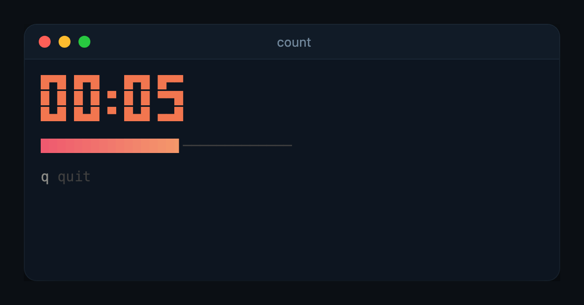

# Build your first tool

This builds `count`, a ten-second countdown with big digits, a progress bar
and a key hint. It takes about 50 lines and shows the loop every kiln tool is
built around: draw the pane, wait for an event, repeat, then leave a line in
scrollback.



## 1. Make the crate

```sh
cargo new count
cd count
```

Add the dependencies to `Cargo.toml`:

```toml
[dependencies]
anyhow = "1"
crossterm = "0.29"
ratatui = "0.30"
kiln = { git = "https://github.com/Zfinix/kiln", tag = "v0.2.0" }
tokio = { version = "1", features = ["rt", "macros", "time"] }
```

## 2. Write the loop

Replace `src/main.rs` with:

```rust
use std::time::{Duration, Instant};

use anyhow::Result;
use crossterm::event::KeyCode;
use kiln::guard::TuiGuard;
use kiln::render::{Column, Inset, Insets, Renderable};
use kiln::terminal::{Tui, TuiEvent, restore_raw};
use kiln::{bigtext, cells, keys, progress, theme};
use ratatui::text::Line;

const KEYS: [keys::Binding; 1] = [("q", "quit")];

#[tokio::main(flavor = "current_thread")]
async fn main() -> Result<()> {
    let total = Duration::from_secs(10);
    let started = Instant::now();
    let _guard = TuiGuard::install(restore_raw);
    let mut tui = Tui::new(6)?;
    let frames = tui.frame_requester();

    loop {
        let left = total.saturating_sub(started.elapsed());
        if left.is_zero() {
            break;
        }
        let width = tui.width();
        let clock = format!("00:{:02}", left.as_secs() + 1);
        let done = started.elapsed().as_secs_f64() / total.as_secs_f64();

        let mut pane = Column::new();
        pane.push(bigtext::lines(&clock, theme::get().accent_style()));
        pane.push(Inset::new(
            Line::from(progress::bar(done, 30)),
            Insets::tlbr(1, 0, 0, 0),
        ));
        pane.push(Inset::new(keys::footer(&KEYS), Insets::tlbr(1, 0, 0, 0)));
        tui.draw(pane.desired_height(width), |frame| {
            pane.render(frame.area(), frame.buffer_mut());
        })?;

        frames.schedule_in(Duration::from_millis(200));
        match tui.next_event().await {
            TuiEvent::Key(key) if key.code == KeyCode::Char('q') => return Ok(()),
            TuiEvent::Resize => tui.resized()?,
            TuiEvent::Key(_) | TuiEvent::Mouse(_) | TuiEvent::Paste(_) | TuiEvent::Draw => {}
        }
    }

    tui.insert_history(cells::notice("Time is up.", tui.width() as usize))?;
    Ok(())
}
```

What each part does:

- `TuiGuard::install(restore_raw)` puts the terminal back if the program
  panics, so a crash never leaves your shell in raw mode.
- `Tui::new(6)` opens a live pane six rows tall at the cursor. Everything
  above it stays normal terminal output.
- `Column` stacks the pieces and reports how tall they are, so
  `tui.draw(pane.desired_height(width), ...)` always sizes the pane to fit.
- `frames.schedule_in(200ms)` asks for the next frame. Without it the loop
  would only wake on key presses.
- `insert_history` writes the final line above the pane, into scrollback,
  where it stays after the program exits.

## 3. Run it

```sh
cargo run
```

Watch it count down, or press `q` to quit early. When it finishes, the pane
disappears and "Time is up." is left in your terminal.

## Next steps

- Give it a length from the command line and a `--json` flag. See
  [conventions](conventions.md) for how the other tools handle arguments.
- Read `tock/src` in this repository: it is this program grown up, with
  pause, restart and a help overlay.
- The [kiln README](https://github.com/Zfinix/kiln#components) lists every
  component you can put in the pane.
